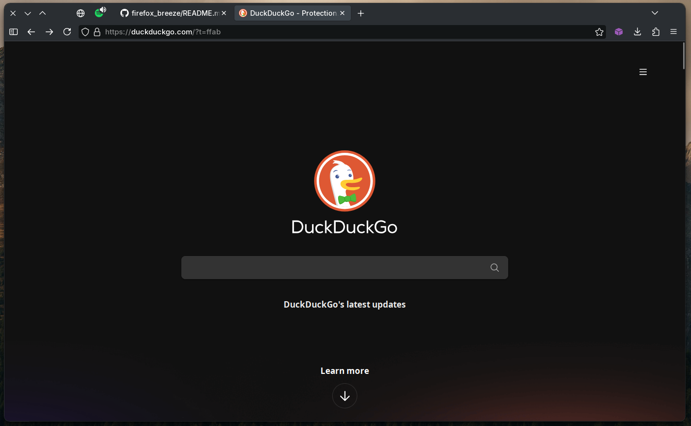

# firefox_breeze

A Firefox `userChrome.css` theme designed to match the KDE Breeze Dark style for a consistent desktop look.

## 📦 Prerequisites

- In Firefox, open `about:config`.
- Search for `toolkit.legacyUserProfileCustomizations.stylesheets` and set it to `true`.

## 📥 How to Install

1. Download the contents of this repository.
2. Unzip the files if necessary.
3. In Firefox, go to `about:support`.
4. Under **Application Basics**, find **Profile Directory** and click **Open Directory**.
5. If a `chrome` folder does not exist, create one.
6. Copy the contents of this repository into the `chrome` folder.

## 🪜 Further steps
- To make the colors match, apply [this color theme](https://color.firefox.com/?theme=XQAAAAKHAQAAAAAAAABBqYhm849SCia73laEGccwS-xMDPr6BEKkxUfveH6amcirjQTFhOx-oGyH8feq4wHD19q59yNlbgMyV3ROhwWCDRm2mv6MXmUe6P8QV9imjXCKi55ZYBJzJuiIvT5RgClNJgRZVp71HH7foWOKi1Xsr_mj7f7ySD6BjvGyjnMKfO0Wu_97eigknp8b-QpuYltM78KJKeaqG2q0qSdJKbhtwpZX4C46_shaDME5t6-HAkEPwZVujzdqsJj5FYYCdICnBC5Q47dCJNezk0zXP5GsyCaXf-hF3kCi6MXGlGzywzhlw2__2UueAA) using [Firefox Color](https://color.firefox.com/).
- For rounded bottom corners, use: [KDE-Rounded-Corners](https://github.com/matinlotfali/KDE-Rounded-Corners)

## 📸 Preview

---

## 📄 License

This project is licensed under the terms of the [LICENSE](LICENSE) file.
